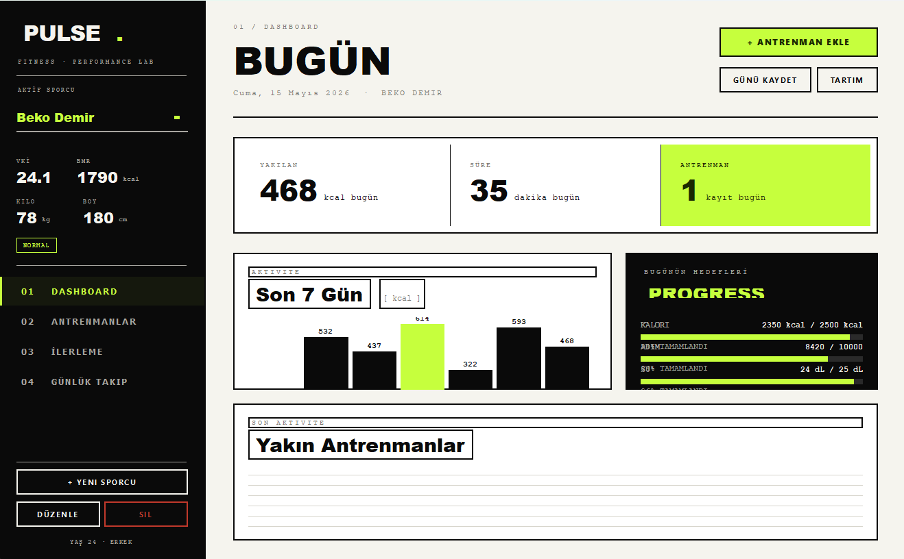
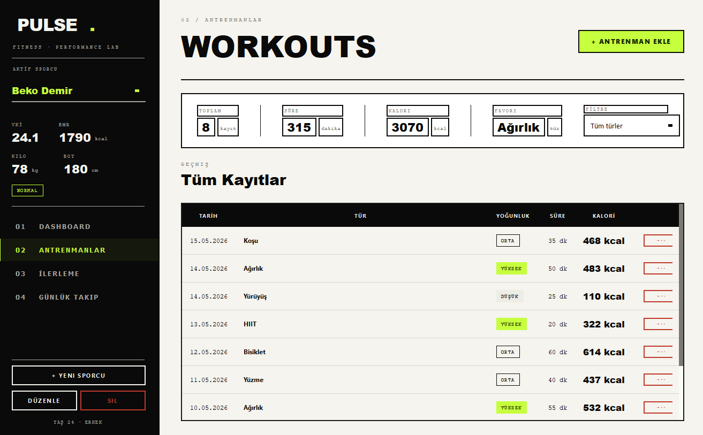
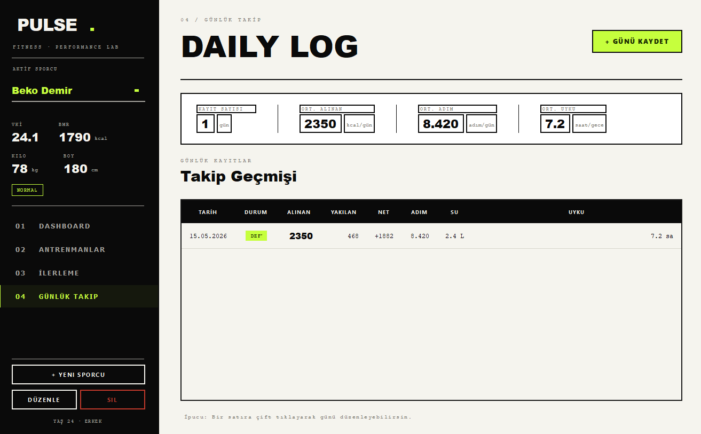
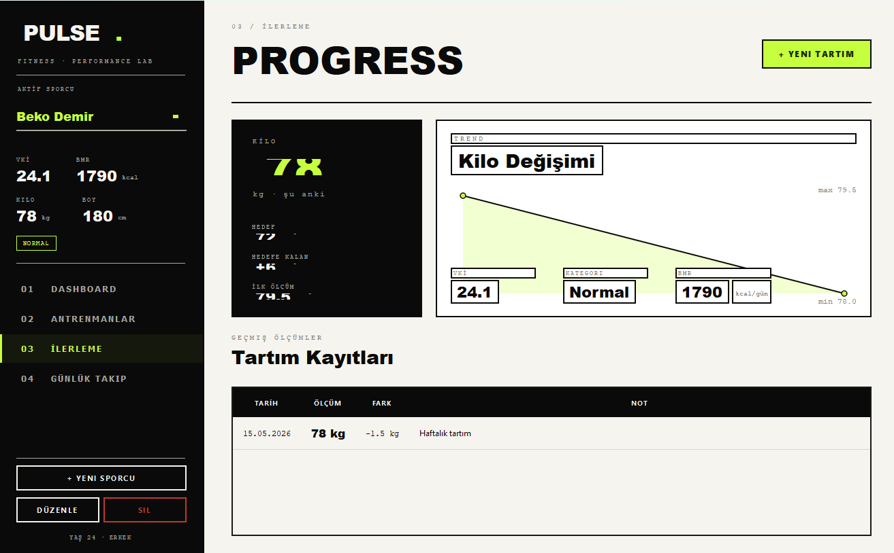

# PULSE - Fitness Takip Sistemi

Antrenman kayitlari, gunluk besin/su takibi ve ilerleme grafikleri ile kisisel fitness verilerinin yonetildigi masaustu uygulamasidir. PyQt5 ile koyu temali, electric lime accentli modern bir arayuz sunar.

## Teknolojiler

- **Python 3** - Programlama dili
- **PyQt5 (>=5.15.0)** - Masaustu GUI framework
- **JSON** - Veri kaliciligi

## Proje Yapisi

    PROJE 7 - Fitness Takip Sistemi/
    ├── main.py                          # Ana giris noktasi
    ├── requirements.txt                 # Bagimliliklar
    ├── backend/
    │   ├── veri_yoneticisi.py          # CRUD islemleri ve istatistikler
    │   ├── kullanici.py                # Kullanici modeli
    │   ├── antrenman.py                # Antrenman modeli
    │   ├── gunluk_kayit.py             # Gunluk kayit modeli
    │   └── seed.py                     # Ornek veri yukleme
    ├── frontend/
    │   ├── ana_pencere.py              # Ana pencere
    │   ├── tema.py                     # Koyu tema + electric lime accent
    │   ├── views/
    │   │   ├── dashboard.py            # Bugun ekrani
    │   │   ├── antrenmanlar.py         # Antrenman kayitlari
    │   │   ├── gunluk_takip.py         # Daily log
    │   │   └── ilerleme.py             # Progress / kilo takibi
    │   └── widgets/
    │       ├── bilesenler.py           # UI bilesenleri
    │       └── diyaloglar.py           # Modal diyaloglar
    ├── images/                          # Ekran goruntuleri
    └── data/
        ├── kullanici.json
        ├── antrenmanlar.json
        └── gunluk_kayitlar.json

## Ana Siniflar

### Kullanici (`backend/kullanici.py`)

- **Ozellikler:** `kullanici_id`, `ad`, `boy`, `baslangic_kilo`, `hedef_kilo`, `yas`
- **Metodlar:** BMI hesaplama, hedef ilerleme yuzdesi

### Antrenman (`backend/antrenman.py`)

- **Ozellikler:** `antrenman_id`, `tarih`, `tur`, `sure_dk`, `tekrar`, `kalori`, `not`
- **Metodlar:** Toplam yuk hesaplama, sure formatlama

### GunlukKayit (`backend/gunluk_kayit.py`)

- **Ozellikler:** `tarih`, `kilo`, `kalori_alimi`, `adim_sayisi`, `su_litre`
- **Metodlar:** Hedef karsilastirma, gunluk ozet

## Ozellikler

- **Bugun (Dashboard):** Anlik metrikler (kalori, adim, su, kilo) + son 7 gun bar grafigi + yakin antrenmanlar listesi
- **Antrenmanlar:** Tarih, tur, sure, tekrar, kalori bilgileri ile kayit ekleme/duzenleme/silme + tum kayitlar tablosu + filtreleme
- **Daily Log:** Gunluk kilo, kalori, adim ve su miktari kaydi + takip gecmisi tablosu
- **Progress:** Kilo degisimi cizgi grafigi + tartim kayitlari listesi + hedef ile karsilastirma
- **Tasarim:** Koyu tema (siyah arkaplan) + electric lime accent (#c5ff00) + monospaced rakam tipografisi

## Ekran Goruntuleri

### Giris Ekrani

### Antrenmanlar

### Gunluk Takip

### Ilerleme

## Kurulum ve Calistirma

    pip install -r requirements.txt
    python main.py

## Ornek Veri

Ilk calistirmada ornek antrenman ve gunluk kayitlar otomatik olusturulur.
